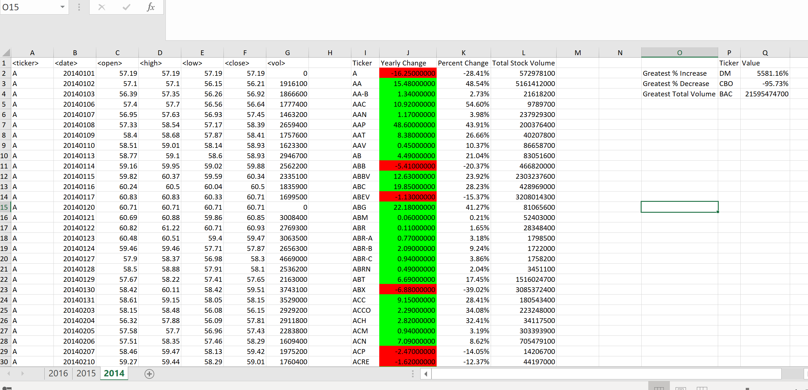
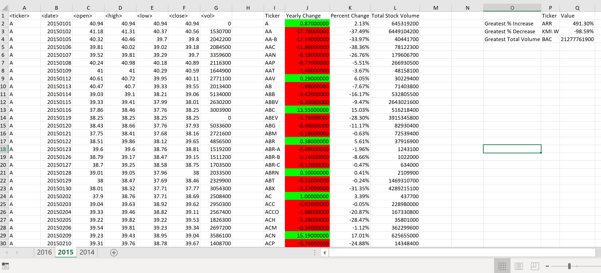
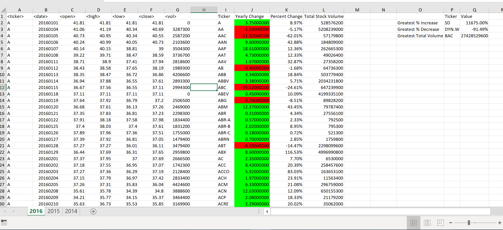

VBA Scripting HOMEWORK 2

1. Desclare the Ws as the current sheet and use "For Each" to loop the execution in every sheet.
2. Initially, it gets the Open price for the first stock ticker in each sheet and in the For loops, when the ticker is changed in first column: it updates the closed price, gets the total sum volume, and updates the open price for next ticker.
3. Based on values from the loops to calculate and fill in the summary table.
4. With the summary table, find the greatest change, smallest one and maximum volume then update to the outcomed table.

